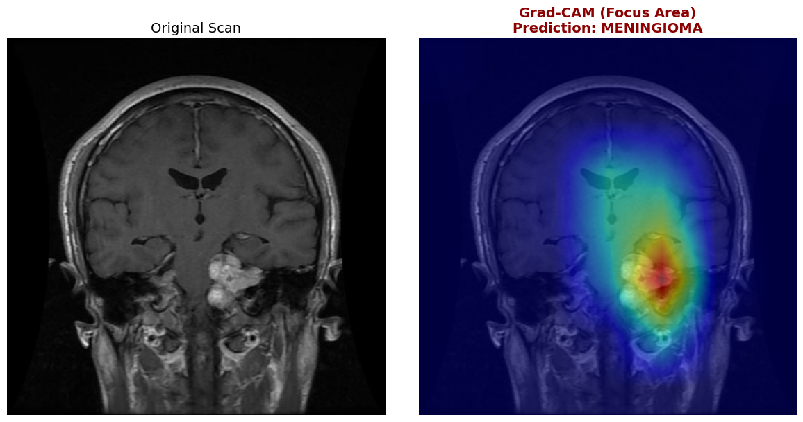

# 🧠 Brain Tumor Classification & Explainable AI (Grad-CAM)


## 📌 Overview
This repository contains a robust deep learning pipeline for classifying brain tumors from MRI scans, developed as a final year BCA academic project. 

The project goes beyond standard classification by implementing **Explainable AI (XAI)** using **Grad-CAM** (Gradient-weighted Class Activation Mapping). This allows us to visualize exactly where the model is looking when making a medical diagnosis, ensuring the network is identifying biological features rather than memorizing image artifacts or borders.

## 📊 Dataset
The model is trained to classify MRI scans into four distinct categories:
1. Glioma Tumor
2. Meningioma Tumor
3. Pituitary Tumor
4. No Tumor (Healthy)

*Note: The dataset utilizes a custom PyTorch `DataLoader` with dynamic augmentations (rotations, horizontal flips) to prevent overfitting.*

## 🏗️ Architecture & Evolution

### Phase 1: Custom CNN (Baseline)
Initially, a custom 4-block Convolutional Neural Network was built from scratch. While it successfully learned the data, Grad-CAM analysis revealed "shortcut learning," where the shallow network occasionally focused on the skull borders rather than the tumor mass.

### Phase 2: ResNet50 & Transfer Learning
To achieve clinical-grade feature extraction, the architecture was upgraded to a **Pre-trained ResNet50** model. 
* The final fully connected layer was replaced and fine-tuned for our 4 specific classes.
* **Result:** Validation accuracy increased dramatically to **~95%**, successfully locked directly onto the complex tumor textures.

## 🛠️ Tech Stack
- **Deep Learning:** PyTorch, Torchvision
- **Computer Vision:** OpenCV, PIL
- **Data Analysis:** NumPy, Pandas, Matplotlib
- **Explainable AI:** Custom Grad-CAM implementation

## 🔬 Visualizing the AI's "Thoughts" (Grad-CAM)




> **Insight:** By analyzing the gradients flowing into the final convolutional layers, we generate a spatial map highlighting the regions most responsible for the final prediction.

## 🚀 How to Run Locally

1. **Clone the repository:**
   ```bash
   git clone [https://github.com/ykr1008/Brain-Tumor-Gradcam.git](https://github.com/ykr1008/Brain-Tumor-Gradcam.git)
   cd Brain-Tumor-Gradcam